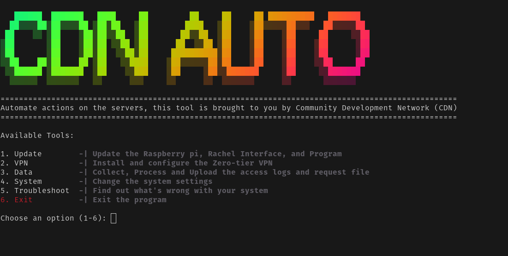

<h1 align="center"> CDN Auto </h1>

> This is a tool to simplify some of the actions done on the CDN Server. It is designed to be run on a Raspberry Pi running the CDN Server but will still work on any Rachel OS. It is not designed to be run on a Windows machine. Do not run the install script on your machine.

<!-- Image -->
<p align="center">
  
</p>

## Installation

```bash
git clone https://github.com/ComDevNet/cdn-auto.git
cd cdn-auto
chmod +x install.sh
./install.sh
```

## Usage

```bash
./main.sh
```

## Things Simplified

- [x] Update the system
- [x] Update the Rachel Interface
- [x] Update Script
- [x] Connect VPN
- [x] Check VPN Status
- [x] Change Interface (git branching)
- [x] System Configuration
- [x] Shutdown System
- [x] Reboot System
- [x] Collect Logs
- [x] Process Logs
- [x] Collect Content Request File
- [x] Disconnect from VPN Network
- [x] Change Wifi Name
- [x] Add wifi Password
- [x] Upload Data to Server
- [x] Troubleshoot System

---

## ⚙️ Automation

Automation lives in scripts/data/automation and is fully documented there. It installs a systemd service/timer to run the collection → processing → filtering → upload/queue pipeline, with offline queueing and a guided configuration.

See the complete guide: scripts/data/automation/README.md

---

## 📚 Documentation map

- [scripts/data/README.md](scripts/data/README.md) — Data pipeline overview and flow
- [scripts/data/collection/README.md](scripts/data/collection/README.md) — How logs are collected (v4/v5), outputs
- [scripts/data/process/README.md](scripts/data/process/README.md) — Processing flow and CSV schemas
  - [scripts/data/process/processors/README.md](scripts/data/process/processors/README.md) — Processor internals (log.py, logv2.py, castle.py)
- [scripts/data/upload/README.md](scripts/data/upload/README.md) — Manual upload flow and CSV month filtering
- [scripts/data/automation/README.md](scripts/data/automation/README.md) — Automation with systemd (install, configure, run, troubleshoot)
- [scripts/system/README.md](scripts/system/README.md) — System operations (networking, modem, Wi‑Fi, Raspberry Pi config)
- [scripts/troubleshoot/README.md](scripts/troubleshoot/README.md) — Diagnostic tools (Kolibri, OC4D, storage, Wi‑Fi)
- [scripts/update/README.md](scripts/update/README.md) — Update helpers (OS and tool)
- [scripts/vpn/README.md](scripts/vpn/README.md) — VPN connect/disconnect/status
- [config/README.md](config/README.md) — automation.conf settings, ownership, permissions
- [00_DATA/README.md](00_DATA/README.md) — Data directory layout and naming
