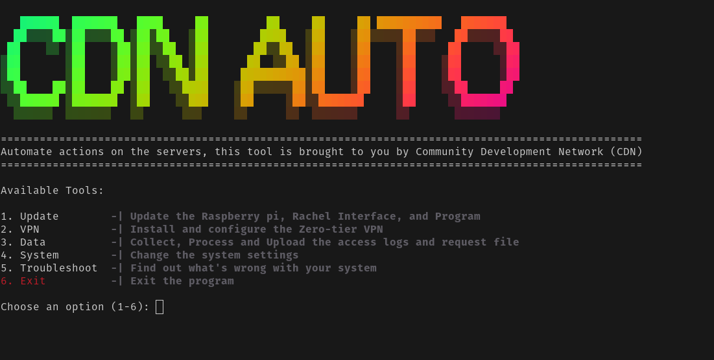

<h1 align="center"> CDN Auto </h1>

> Edge automation for CDN / Rachel OS (Raspberry Pi): harvest usage logs + OC4D assessments, queue uploads offline-safe, back up local Postgres. **Not for Windows.**

<p align="center">
  
</p>

## Where to read docs

| Doc | When to open it |
|-----|-----------------|
| **[docs/DEVELOPER-WIKI.md](docs/DEVELOPER-WIKI.md)** | **Complete technical reference** — architecture, every conf key, schedules, harvest/queue/dispatch, OC4D assessment internals, Postgres/CSV schemas, APIs, S3 keys, systemd, runbooks, troubleshooting |
| [config/README.md](config/README.md) | Every `automation.conf` key |
| [scripts/data/automation/README.md](scripts/data/automation/README.md) | Day-to-day harvester / dispatcher ops |
| [CHANGELOG.md](CHANGELOG.md) | Release history |

This repo has **no** Dockerfiles, Terraform, or CI workflows. Schema ownership for OC4D Postgres lives in `oc4d-server`; the wiki documents what cdn-auto **reads and writes**.

---

## Install on a Pi

```bash
git clone https://github.com/ComDevNet/cdn-auto.git
cd cdn-auto
chmod +x install.sh
./install.sh

sudo ./scripts/data/automation/install.sh
sudo ./scripts/data/automation/configure.sh
./scripts/data/automation/status.sh

# optional
sudo ./scripts/data/automation/migrate_near_realtime.sh   # 15‑minute cadence
sudo ./scripts/database/install.sh                        # needs Docker oc4d_db
```

Full steps + troubleshooting: [Wiki §2 Runbooks](docs/DEVELOPER-WIKI.md#2-runbooks).

## Use it

```bash
./main.sh
# after install: cdn-auto
```

| # | Menu | What it covers |
|---|------|----------------|
| 1 | Update | OS / Rachel / this tool |
| 2 | VPN | ZeroTier |
| 3 | Data | Collect, process, upload, automation |
| 4 | System | Network, Wi‑Fi, Pi config |
| 5 | Troubleshoot | Diagnostics |
| 6 | Database | OC4D Postgres backup / restore |
| 7 | Exit | |

## How it works (short)

```text
Harvester (offline OK)                     Dispatcher (needs uplink + window)
  logs → CSV → filter ─┐
  assessments (DB→API)─┴─► 00_UPLOAD_QUEUE/*/pending  ─►  S3
```

| Upload | Goes to |
|--------|---------|
| RACHEL / ModuleGaze CSVs | `S3_BUCKET` |
| Assessment results + marking schemes | `OC4D_BUCKET` (default `oc4d-raw-reports`) — stored in S3; cloud CSV Lambda does **not** ingest these keys yet |
| Postgres dumps | `/var/backups/oc4d/database` |

Usage dashboard ingest (in sibling `oc4d` repo) applies to **`…/RACHEL/`** (and Kolibri) on `oc4d-raw-reports` only. Kolibri is out of scope for cdn-auto. Details: [wiki §14](docs/DEVELOPER-WIKI.md#14-cloud-ingest-verified-against-oc4d).

## More docs

| Path | Topic |
|------|--------|
| [scripts/data/README.md](scripts/data/README.md) | Pipeline overview |
| [scripts/data/collection/README.md](scripts/data/collection/README.md) | Log collection |
| [scripts/data/process/README.md](scripts/data/process/README.md) | Processors / usage CSV columns |
| [scripts/data/upload/README.md](scripts/data/upload/README.md) | Manual upload + OC4D |
| [scripts/database/README.md](scripts/database/README.md) | Backup / restore |
| [scripts/system/README.md](scripts/system/README.md) · [troubleshoot](scripts/troubleshoot/README.md) · [update](scripts/update/README.md) · [vpn](scripts/vpn/README.md) | Other menus |
| [docs/OC4D-ASSESSMENT-INTEGRATION-TEST-HANDOFF.md](docs/OC4D-ASSESSMENT-INTEGRATION-TEST-HANDOFF.md) | Older E2E notes — trust the wiki if they conflict |

## Quick checks (dev laptop)

```bash
python3 -m pip install -r requirements.txt
bash scripts/data/lib/test_queue_states.sh
python3 scripts/data/process/processors/test_assessment.py
python3 scripts/data/automation/test_time_window.py
```
