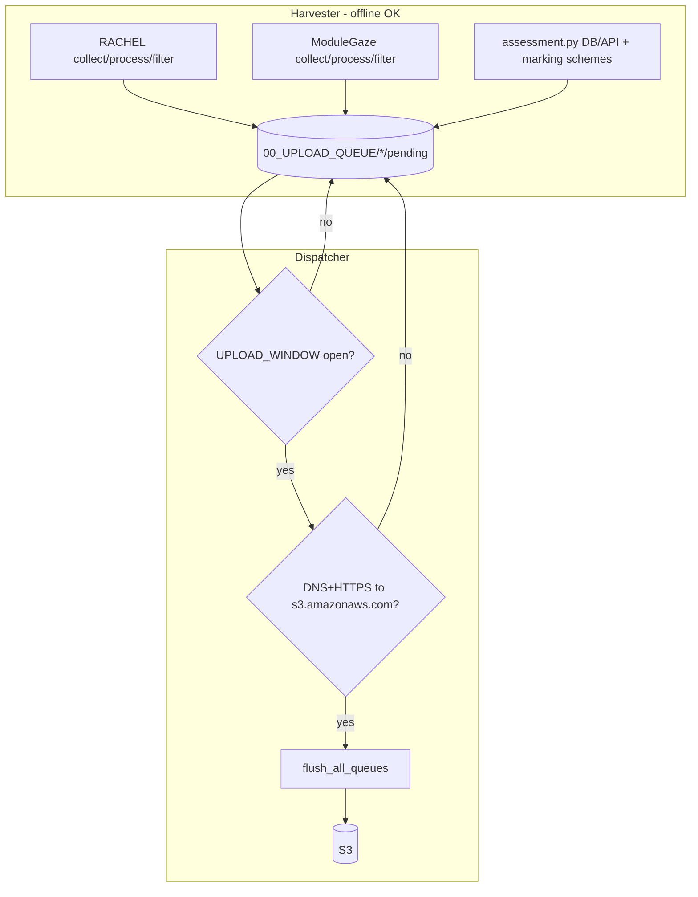

# CDN Auto — Developer Wiki (Complete Reference)

Definitive technical documentation for the `cdn-auto` repository. Prefer this file over older handoff notes when they disagree.

| | |
|--|--|
| **Audience** | Maintainers, onboarding developers, field ops |
| **Platform** | Raspberry Pi / Rachel OS (Linux). Not supported on Windows. |
| **Owns** | Harvest/dispatch automation, CSV/S3 contracts, systemd installers, OC4D DB backup scripts, interactive menus |
| **Does not own** | `oc4d-server` Prisma migrations, cloud OC4D Lambdas/DynamoDB, Docker images for OC4D, Terraform, GitHub Actions |
| **Related repos** | `oc4d-server` (Pi app + Postgres `oc4d_db`), `oc4d` (cloud ingest + dashboard) |
| **Historical E2E notes** | [OC4D-ASSESSMENT-INTEGRATION-TEST-HANDOFF.md](./OC4D-ASSESSMENT-INTEGRATION-TEST-HANDOFF.md) (partially superseded — see delta banner there) |

**Doc ownership rule:** any PR that changes queue layout, S3 keys, assessment SQL/CSV shape, consumed API fields, schedule semantics, or systemd installers must update this wiki in the same change.

---

## Table of contents

1. [Overview and ecosystem](#1-overview-and-ecosystem)
2. [Repository map](#2-repository-map)
3. [Menus and entrypoints](#3-menus-and-entrypoints)
4. [Architecture deep dive](#4-architecture-deep-dive)
5. [Configuration reference](#5-configuration-reference)
6. [Schedule and time windows](#6-schedule-and-time-windows)
7. [Harvest pipeline (detailed)](#7-harvest-pipeline-detailed)
8. [Queue protocol (detailed)](#8-queue-protocol-detailed)
9. [Dispatch / upload (detailed)](#9-dispatch--upload-detailed)
10. [OC4D assessment pipeline (detailed)](#10-oc4d-assessment-pipeline-detailed)
11. [Data shapes and schemas](#11-data-shapes-and-schemas)
12. [API contracts](#12-api-contracts)
13. [S3 contracts](#13-s3-contracts)
14. [Cloud ingest (verified against `oc4d`)](#14-cloud-ingest-verified-against-oc4d)
15. [Database backup and restore](#15-database-backup-and-restore)
16. [Systemd and infrastructure scripts](#16-systemd-and-infrastructure-scripts)
17. [Runbooks](#17-runbooks)
18. [Testing](#18-testing)
19. [Troubleshooting encyclopedia](#19-troubleshooting-encyclopedia)
20. [Documentation map](#20-documentation-map)

---

## 1. Overview and ecosystem

### 1.1 What CDN Auto is

CDN Auto is the **edge glue** that runs on CDN/Rachel field servers. It:

1. Collects access / ModuleGaze logs from the local filesystem  
2. Parses them into CSV summaries with version-specific Python processors  
3. Filters rows into schedule windows (daily, near-realtime, Castle hourly, etc.)  
4. Harvests OC4D assessment results from **local Postgres** (HTTP API fallback)  
5. Builds marking-scheme artifacts for cloud grading  
6. Enqueues everything in a durable on-disk queue that survives power loss  
7. Uploads to AWS S3 only when online and inside a configured upload window  
8. Optionally backs up the local OC4D Docker Postgres on a timer  

It does **not** POST analytics to `oc4d-server`. Local `http://127.0.0.1:3000` is only used as an assessment-results **fallback**. Cloud usage dashboards are fed by S3 → Lambda → DynamoDB for **RACHEL / Kolibri** keys only (verified in the `oc4d` repo — see [§14](#14-cloud-ingest-verified-against-oc4d)). Assessment / ModuleGaze / MarkingSchemes uploads land in S3 but are **not** ingested by that Lambda today.

### 1.2 Ecosystem diagram

```text
┌────────────────────────── Pi edge ──────────────────────────┐
│  oc4d-server  (app :3000 + Docker Postgres oc4d_db)         │
│  ModuleGaze   (:3002, /var/log/modulegaze)                  │
│  Access logs  (/var/log/apache2 | /var/log/oc4d | dhub)     │
│                                                             │
│  cdn-auto                                                   │
│   ├─ Harvester  collect→process→filter→enqueue              │
│   ├─ Dispatcher window+online → S3 flush                    │
│   └─ DB backup  pg_dump → /var/backups/oc4d/database        │
└─────────────────────────────┬───────────────────────────────┘
                              │ AWS CLI (S3)
                              ▼
┌──────────────────────── Cloud (oc4d repo) ──────────────────┐
│  S3_BUCKET (usage) and/or OC4D_BUCKET (default              │
│             oc4d-raw-reports)                               │
│                                                             │
│  …/RACHEL/*.csv  ──OBJECT_CREATED──► csv-report-generator   │
│       triggered Lambda ──► DynamoDB oc4d-reports-table      │
│       ──► GET /dashboard/{org} (usage UI)                   │
│                                                             │
│  …/ModuleGaze|Assessments|MarkingSchemes/*  → stored in S3  │
│       (trigger may fire; handler currently SKIPS)           │
└─────────────────────────────────────────────────────────────┘
```

### 1.3 Feature inventory (current architecture)

| Feature | Detail |
|---------|--------|
| Harvest / dispatch split | Separate systemd timers; harvest never requires network |
| Durable queue FSM | Per-stage `pending` → `uploading` → `completed` (+ reserved `failed/`) |
| Concurrent lock | `flock` on `.automation.lock`, wait 900s, then skip |
| Near-realtime | 15/30/60 min; filter = today 00:00→now; `UPLOAD_WINDOW=always` |
| Castle hourly | Prior completed clock hour only when `PYTHON_SCRIPT=cape_coast_d` |
| ModuleGaze stream | Optional; sessions logs → `ModuleGaze/` on `S3_BUCKET` |
| OC4D assessments | DB-first; auto student/assessment IDs; marking schemes + subject JSON |
| Offline resilience | Pending queue + reconnect flush; force flush script |
| Database backups | `oc4d-db-backup.timer` every 6h, keep 10 gzipped dumps |
| Kolibri | **Out of scope** — not produced by cdn-auto |

### 1.4 Design principles

| Principle | How it shows up |
|-----------|-----------------|
| Power-cycle safe | Harvest often into disk queue; upload separately |
| Stage isolation | RACHEL / ModuleGaze / OC4DAssessments never share filenames or sidecars |
| Fail soft per stream | One stage failing does not abort other streams |
| Idempotent OC4D | `uploaded-state.json` records result IDs **after** S3 success |
| Org isolation | S3 keys always under `{parentOrg}/…` for assessments |
| Configure over hand-edit | `configure.sh` owns `automation.conf` + timer drop-ins |

---

## 2. Repository map

```text
cdn-auto/
├── main.sh / install.sh / exit.sh / requirements.txt
├── README.md / CHANGELOG.md
├── config/
│   ├── automation.conf          # gitignored; generated on device
│   ├── README.md
│   └── oc4d/
│       ├── student-map.example.csv
│       ├── assessment-map.example.csv
│       ├── api-credentials.example
│       ├── module-map.csv       # checked in (ModuleGaze fallback)
│       ├── student-map.csv      # gitignored live overrides
│       ├── assessment-map.csv   # gitignored live overrides
│       └── database.url         # optional; often gitignored locally
├── docs/
│   ├── DEVELOPER-WIKI.md        # this file
│   └── OC4D-ASSESSMENT-INTEGRATION-TEST-HANDOFF.md
├── scripts/
│   ├── lib/permissions.sh
│   ├── data/
│   │   ├── main.sh / all.sh / all/v{1..5}/…
│   │   ├── collection/
│   │   ├── process/processors/{log,logv2,castle,dhub,log-v6,modulegaze,assessment}.py
│   │   ├── upload/
│   │   ├── automation/          # harvester/dispatcher heart
│   │   └── lib/{s3_helpers,oc4d_assessment_helpers,cleanup_helpers}.sh
│   ├── database/                # Postgres backup/restore
│   ├── system/ / vpn/ / update/ / troubleshoot/
│   └── …
└── 00_DATA/                     # gitignored runtime data
```

| Path | Responsibility |
|------|----------------|
| `scripts/data/automation/runner.sh` | Harvest / dispatch orchestration |
| `scripts/data/automation/configure.sh` | Interactive config + timer overrides |
| `scripts/data/automation/install.sh` | Systemd units + flock wrappers |
| `scripts/data/lib/s3_helpers.sh` | Queue FSM + RACHEL/ModuleGaze S3 |
| `scripts/data/lib/oc4d_assessment_helpers.sh` | OC4D keys, queue, flush, API helpers |
| `scripts/data/process/processors/assessment.py` | Assessment harvest + marking schemes |
| `scripts/database/*` | `pg_dump` / restore / timer |

---

## 3. Menus and entrypoints

### 3.1 Root menu (`main.sh`)

| # | Label | Script |
|---|-------|--------|
| 1 | Update | `scripts/update/main.sh` |
| 2 | VPN | `scripts/vpn/main.sh` |
| 3 | Data | `scripts/data/main.sh` |
| 4 | System | `scripts/system/main.sh` |
| 5 | Troubleshoot | `scripts/troubleshoot/main.sh` |
| 6 | Database | `scripts/database/main.sh` |
| 7 | Exit | `exit.sh` |

After `install.sh`, symlink: `cdn-auto` → `main.sh` (`~/bin` and `/usr/local/bin`).

### 3.2 Data menu (`scripts/data/main.sh`)

| # | Label | Script |
|---|-------|--------|
| 1 | Start (all-in-one) | `scripts/data/all.sh` |
| 2 | Collect | `scripts/data/collection/main.sh` |
| 3 | Process | `scripts/data/process/main.sh` |
| 4 | Upload | `scripts/data/upload/main.sh` |
| 5 | Automation | `scripts/data/automation/main.sh` |

### 3.3 Upload menu

| # | Action |
|---|--------|
| 1 | Upload processed RACHEL CSV |
| 2 | Upload ModuleGaze CSV |
| 3 | Pull/upload OC4D assessments (`oc4d_assessments.sh`) |
| 4 | Flush upload queue (`flush_queue.sh`, `FORCE_UPLOAD=1`) |
| 5 | Configure AWS CLI |
| 6 | Change S3 bucket helper |

### 3.4 Database menu

| # | Action |
|---|--------|
| 1 | Install auto backup timer |
| 2 | Run backup now |
| 3 | Restore database |
| 4 | Status |

### 3.5 Primary CLI entrypoints (automation)

| Command | Mode |
|---------|------|
| `./scripts/data/automation/runner.sh harvest` | Default harvest |
| `./scripts/data/automation/runner.sh dispatch` | Windowed flush |
| `./scripts/data/automation/runner.sh all` | Harvest then dispatch |
| `/usr/local/bin/run_v5_log_harvester.sh` | Installed harvest wrapper (+ flock) |
| `/usr/local/bin/run_v5_log_dispatcher.sh` | Installed dispatch wrapper (+ flock) |
| `/usr/local/bin/run_v5_log_processor.sh` | Legacy `all` wrapper |
| `CDN_AUTO_MODE=dispatch ./scripts/data/automation/runner.sh` | Env override for mode |

---

## 4. Architecture deep dive

### 4.1 Harvester vs dispatcher



| Concern | Harvester | Dispatcher |
|---------|-----------|------------|
| Needs S3? | No | Yes |
| Needs `UPLOAD_WINDOW`? | No | Yes (unless `FORCE_UPLOAD=1`) |
| Mutates queue | Writes `pending/` | Moves pending→uploading→completed |
| Marker | `.last_harvest_ok` | `.last_upload_ok` (only if flush fully succeeds) |
| Timer default | Hourly (or `HARVEST_INTERVAL`) | Hourly check / matched cadence when always |

### 4.2 Concurrent-run lock

Installed wrappers open:

```text
/home/pi/cdn-auto/00_DATA/00_UPLOAD_QUEUE/.automation.lock
```

- `flock -w 900` (15 minutes)  
- If lock not acquired → log skip and exit 0  
- Path is **hardcoded** to `/home/pi/cdn-auto/…` in `install.sh` / `update_service_logging.sh` (not `$PROJECT_ROOT`)

### 4.3 Soft-failure model

| Stage failure | Effect on other stages |
|---------------|------------------------|
| RACHEL collect/process/filter fails | ModuleGaze + OC4D still run |
| ModuleGaze fails | RACHEL + OC4D unaffected |
| OC4D processor validation failures | Logged; harvest still writes `.last_harvest_ok`; other streams unaffected |
| Partial S3 flush failure | Remaining items stay `pending`; `.last_upload_ok` not written |

---

## 5. Configuration reference

### 5.1 File locations and permissions

| File | Notes |
|------|-------|
| `config/automation.conf` | Sourced by runner; gitignored; owner service user (usually `pi`); `chmod 600` |
| `config/oc4d/*.csv` maps | Student/assessment live maps gitignored; examples in git |
| `config/oc4d/module-map.csv` | Checked in |
| `config/oc4d/api-credentials` | Optional; copy from `.example`; `chmod 600` |
| `config/oc4d/database.url` | Optional Postgres URL file |

Configure loads existing conf if present, prompts, writes atomically (`*.tmp` → rename), chowns to service user, ensures local OC4D map files when assessments enabled, runs live S3 put-object test (retries with SSE-S3), then installs timer drop-ins.

### 5.2 Keys written by `configure.sh`

| Key | Default | Description |
|-----|---------|-------------|
| `SERVER_VERSION` | `v2` | Internal code: `v1` (UI v4 Apache), `v2` (UI v5), `v3` (dhub), `v6` (UI v6) |
| `PYTHON_SCRIPT` | `oc4d` | When `SERVER_VERSION=v2`: `oc4d` → `logv2.py`, `cape_coast_d` → `castle.py` |
| `DEVICE_LOCATION` | `device` | 2–64 chars `[A-Za-z0-9_-]`; used in folder/CSV names |
| `S3_BUCKET` | `s3://example-bucket` | RACHEL + ModuleGaze destination |
| `S3_SUBFOLDER` | `""` | Optional prefix under bucket |
| `RACHEL_SUBFOLDER` | `""` | Optional under `…/RACHEL/` |
| `SCHEDULE_TYPE` | `daily` | See [§6](#6-schedule-and-time-windows) |
| `RUN_INTERVAL` | `86400` | Seconds for filter stamp / custom / near-realtime interval |
| `HARVEST_INTERVAL` | `3600` | Harvester `OnUnitActiveSec`; near-realtime = `RUN_INTERVAL` |
| `UPLOAD_WINDOW` | derived | `always` or `HH:MM-HH:MM` (overnight OK). Empty → daily `00:00-01:00`, near_realtime `always`, else `always` |
| `MODULEGAZE_ENABLED` | `1` | |
| `MODULEGAZE_API_BASE_URL` | `http://127.0.0.1:3002` | |
| `MODULEGAZE_MODULE_MAP_FILE` | `$PROJECT_ROOT/config/oc4d/module-map.csv` | |
| `OC4D_ASSESSMENTS_ENABLED` | `0` | Prompted only for `SERVER_VERSION` `v2` or `v6` |
| `OC4D_API_BASE_URL` | `http://127.0.0.1:3000` | Forced to this when enabling assessments in configure |
| `OC4D_API_TOKEN` | `""` | Cleared when enabling via configure (DB-first) |
| `OC4D_BUCKET` | `oc4d-raw-reports` | Name or `s3://…` |
| `OC4D_PARENT_ORG` | `Home-Schooling` | Picked from S3 prefixes when enabling |
| `OC4D_UPLOAD_MODE` | `direct_s3` | `presigned_api` reserved; runner warns and uses direct |
| `OC4D_SOURCE_DIR` | `""` | Optional folder of `{assessment}__{student}.csv`; unmapped rows fail (no `unassigned`) |
| `OC4D_STUDENT_MAP_FILE` | `config/oc4d/student-map.csv` | |
| `OC4D_ASSESSMENT_MAP_FILE` | `config/oc4d/assessment-map.csv` | |
| `OC4D_STATE_FILE` | `00_DATA/00_OC4D_ASSESSMENTS/uploaded-state.json` | |
| `OC4D_UNASSIGNED_STUDENT_ID` | `unassigned` | S3 student segment when unmapped |
| `OC4D_STUDENT_PREFIX_SYNC` | `1` | Discover student ids from cloud S3 prefixes |
| `OC4D_CLOUD_STUDENT_MAP_FILE` | `""` | |
| `OC4D_CLOUD_STUDENT_MAP_S3_URI` | `""` | |
| `OC4D_CLOUD_STUDENT_MAP_URL` | `""` | Supports `{parentOrg}` placeholder |
| `OC4D_CLOUD_STUDENTS_API_BASE_URL` | `""` | |
| `OC4D_CLOUD_API_TOKEN` | `""` | Bearer for cloud roster HTTP |

Also see [config/README.md](../config/README.md).

### 5.3 Runner / processor-only keys (optional in conf)

| Key | Default | Purpose |
|-----|---------|---------|
| `CDN_AUTO_MODE` | `harvest` | Same as CLI arg to `runner.sh` |
| `AWS_PROFILE` | unset | Exported if set |
| `AWS_REGION` | unset | Exported as `AWS_DEFAULT_REGION` |
| `OC4D_ASSESSMENT_SOURCE` | `""` | `api` forces HTTP; else DB first then API |
| `OC4D_DATABASE_URL` | `""` | Direct Postgres URL (highest precedence) |
| `OC4D_DATABASE_URL_FILE` | `config/oc4d/database.url` | File whose first non-`#` line is the URL |
| `OC4D_DB_DOCKER_CONTAINER` | `oc4d_db` | `docker exec … psql` when no URL resolved |
| `OC4D_API_IDENTIFIER` | `admin@comdevnet.com` | Login for token mint |
| `OC4D_API_PASSWORD` | `""` | |
| `OC4D_API_CREDENTIALS_FILE` | `""` | `KEY=value` file |
| `OC4D_STAGING_KEEP` | `2` | Staging dirs to retain |
| `OC4D_API_MAX_RESULTS` | `100000` | DB fetch safety cap |
| `OC4D_API_TAKE` | `2000` | API page size / DB page size base |
| `OC4D_API_START_DATE` | `2020-01-01` | Lower bound for results |
| `OC4D_SCHEME_DELIVERY_VERSION` | `2` | Line 3 of scheme `.oc4dkey`; bump to re-deliver schemes |
| `QUEUE_COMPLETED_RETENTION_DAYS` | `7` | Purge `completed/` older than N days |
| `FORCE_UPLOAD` | `0` | `1` in `flush_queue.sh` bypasses window |
| `CDN_AUTO_PROCESSED_ROOT` | set by runner | Used to cleanup processed folders after RACHEL/ModuleGaze upload |
| `PROJECT_ROOT` | auto from `assessment.py` | Influences DB URL file search roots |

**Postgres URL resolution order** (`assessment.py` → `resolve_database_url`):

1. `OC4D_DATABASE_URL`  
2. Path in `OC4D_DATABASE_URL_FILE` (if set)  
3. `{PROJECT_ROOT}/config/oc4d/database.url`  
4. `{PROJECT_ROOT}/config/oc4d/.database.url`  
5. `/home/pi/oc4d-server/workspaces/website/.env.local` → key `DATABASE_URL`  
6. `/home/pi/oc4d-server/.env` → `DATABASE_URL`  
7. `~/oc4d-server/workspaces/website/.env.local` → `DATABASE_URL`  
8. Else fall through to Docker `psql` on `OC4D_DB_DOCKER_CONTAINER`

### 5.4 Database backup env keys

| Key | Default |
|-----|---------|
| `OC4D_DB_CONTAINER` | `oc4d_db` |
| `OC4D_DB_NAME` | `oc4d` |
| `OC4D_DB_USER` | `postgres` |
| `OC4D_DB_BACKUP_DIR` | `/var/backups/oc4d/database` |
| `OC4D_DB_BACKUP_MAX` | `10` |
| `OC4D_WEB_SERVICE` | `oc4d.service` |

### 5.5 Configure UI → internal `SERVER_VERSION`

| Menu choice | `SERVER_VERSION` | Processor |
|-------------|------------------|-----------|
| Server v4 (Apache) | `v1` | `log.py` |
| Server v5 OC4D | `v2` + `PYTHON_SCRIPT=oc4d` | `logv2.py` |
| Server v5 Castle | `v2` + `PYTHON_SCRIPT=cape_coast_d` | `castle.py` |
| D-Hub | `v3` | `dhub.py` |
| Server v6 | `v6` | `log-v6.py` |

If non-Castle is selected while `SCHEDULE_TYPE=hourly`, configure downgrades to `daily`.

### 5.6 Schedule presets in configure

| Menu | `SCHEDULE_TYPE` | `RUN_INTERVAL` | `HARVEST_INTERVAL` | `UPLOAD_WINDOW` |
|------|-----------------|----------------|--------------------|-----------------|
| Every 15 minutes | `near_realtime` | 900 | 900 | `always` |
| Every 30 minutes | `near_realtime` | 1800 | 1800 | `always` |
| Every hour (near) | `near_realtime` | 3600 | 3600 | `always` |
| Hourly (Castle) | `hourly` | 3600 | prompted (≥300) | prompted |
| Daily | `daily` | 86400 | prompted | default `00:00-01:00` |
| Weekly | `weekly` | 604800 | prompted | prompted |
| Monthly | `monthly` | 2592000 | prompted | prompted |
| Yearly | `yearly` | 31536000 | prompted | prompted |
| Custom | `custom` | ≥300 | prompted | prompted |

Upload window menu (non–near-realtime): `00:00-01:00`, `22:00-06:00`, `always`, or custom `HH:MM-HH:MM`.

---

## 6. Schedule and time windows

Implemented in `scripts/data/automation/time_window.py` and applied by `filter_time_based.py`.

| `SCHEDULE_TYPE` | Filter window | Filename stamp |
|-----------------|---------------|----------------|
| `hourly` | Prior completed clock hour | `HH_dd_mm_YYYY` |
| `daily` | **Yesterday** 00:00:00–23:59:59 | `dd_mm_YYYY` |
| `weekly` | Previous ISO week Mon–Sun | week/`%W_%m_%Y` |
| `monthly` | Previous calendar month | `mm_YYYY` |
| `yearly` | Previous calendar year | `YYYY` |
| `custom` | Last **completed** `RUN_INTERVAL` seconds | `custom_{start}_{Ns}` |
| `near_realtime` / `rolling` | **Today 00:00:00 → now** | `nr_{bucketStart}_{interval}s` |

### Near-realtime semantics (important)

- Filter includes **all of today’s activity so far**, not only the current 15/30/60-minute slice.  
- Filename stamp still rotates every `RUN_INTERVAL` (min 60s, else 900) so harvest cadence is visible.  
- Reason: ModuleGaze cloud ingest SETs day maps from each CSV; partial-day slices would wipe earlier hours.  
- Configure/migrate force `UPLOAD_WINDOW=always` so dispatcher uploads on the same cadence.

Output CSV naming pattern from filter:

```text
{DEVICE_LOCATION}_{file_stamp}_{suffix}.csv
```

Suffix defaults to location-style for RACHEL; ModuleGaze uses `modulegaze_logs`.

---

## 7. Harvest pipeline (detailed)

Entry: `runner.sh harvest` → `run_harvest()`.

Order:

1. `process_rachel_logs` → optional `queue_one` to `RACHEL/pending`  
2. `process_modulegaze_logs` → `queue_one` to `ModuleGaze/pending`  
3. `process_oc4d_assessments` → `queue_oc4d_one` for schemes + results  
4. Write `.last_harvest_ok`

### 7.1 RACHEL collect

Folder: `00_DATA/{DEVICE_LOCATION}_logs_{YYYY_MM_DD}`

| `SERVER_VERSION` | Source dir | Files copied |
|------------------|------------|--------------|
| `v1` | `/var/log/apache2` | `access.log*` |
| `v2` | `/var/log/oc4d` | `oc4d-*.log` (not exceptions), `capecoastcastle-*.log` (not exceptions), `*.gz` |
| `v3` | `/var/log/dhub` | `*.log` |
| `v6` | `/var/log/oc4d` | `oc4d-*.log` excluding exceptions |

Then: decompress `*.gz` in place → run processor → delete raw folder on success → require non-empty `summary.csv` → time-window filter → enqueue.

Missing log dir or processor failure → warn and **return 0** (continue other stages).

### 7.2 ModuleGaze collect

Enabled when `MODULEGAZE_ENABLED=1` and `/var/log/modulegaze` exists.

- Folder: `{DEVICE_LOCATION}_modulegaze_logs_{YYYY_MM_DD}`  
- Copies: `modulegaze-sessions.log`, `modulegaze-sessions-*.log.zip`  
- Clears prior collected `modulegaze-access*` / `modulegaze-sessions*` in that folder before copy  
- Processor: `modulegaze.py` with `MODULEGAZE_API_BASE_URL` + `MODULEGAZE_MODULE_MAP_FILE`  
- Filter suffix: `modulegaze_logs`

### 7.3 OC4D assessments in harvest

See [§10](#10-oc4d-assessment-pipeline-detailed). Enqueue order from manifest:

1. Marking scheme **subject JSON** files  
2. Marking scheme **CSV** files  
3. Assessment result CSVs (with `result_id` for sidecar line 2)

Report log line: `[oc4d][report] queued=… skipped=… failed=…`

---

## 8. Queue protocol (detailed)

Helpers: `scripts/data/lib/s3_helpers.sh`, `oc4d_assessment_helpers.sh`.

### 8.1 Layout

```text
00_DATA/00_UPLOAD_QUEUE/
├── .automation.lock
├── .last_harvest_ok
├── .last_upload_ok
├── RACHEL/{pending,uploading,completed,failed}/
├── ModuleGaze/{pending,uploading,completed,failed}/
└── OC4DAssessments/{pending,uploading,completed,failed}/
```

`prepare_queue_dirs`:

- Creates all stage/state dirs  
- Moves leftover `uploading/*` back to `pending/` (crash recovery)  
- Migrates legacy flat `*.csv` at queue root → `RACHEL/pending`  
- Migrates flat files under a stage dir → that stage’s `pending`

### 8.2 State machine

```text
pending → uploading → completed
              │
              └─(upload fail)→ pending   (retry later)
```

`failed/` exists and is cleared when re-queuing the same basename; the flush path does **not** currently park upload failures there.

### 8.3 Sidecars

| Stage | Sidecar | Format |
|-------|---------|--------|
| RACHEL / ModuleGaze | `{csv}.cdnrun` | Single line: processed run folder name (for cleanup after upload) |
| OC4DAssessments | `{file}.oc4dkey` | Line 1: S3 key<br>Line 2: optional `result_id`<br>Line 3: optional `OC4D_SCHEME_DELIVERY_VERSION` (marking schemes) |

For schemes, if line 2 is empty but line 3 is needed, helpers write a blank line 2 then the version.

### 8.4 Dedup rules

**RACHEL / ModuleGaze (`queue_one`):** skip if same basename already in `completed/` or `uploading/`; replace pending twin; clear failed twin.

**OC4D (`queue_oc4d_one`):** skip if identical payload + same S3 key (+ same scheme version when applicable) already in `uploading/` or `completed/` or `pending/`. Changed scheme content replaces completed copy. Pending sidecar `result_id` can be refreshed without re-copying payload.

### 8.5 Retention

`purge_completed_queue` deletes files in `completed/` older than `QUEUE_COMPLETED_RETENTION_DAYS` (default 7) during flush.

### 8.6 Markers

| File | Written when |
|------|----------------|
| `.last_harvest_ok` | End of every harvest |
| `.last_upload_ok` | End of `flush_all_queues` with zero stage failures |

---

## 9. Dispatch / upload (detailed)

Entry: `runner.sh dispatch` → `run_dispatch()`.

1. If `upload_window_open` is false → log hint, exit 0  
2. If `has_internet` false (DNS `s3.amazonaws.com` + optional `curl -Is https://s3.amazonaws.com`) → leave pending  
3. Else `flush_all_queues`

`flush_all_queues` order:

1. `prepare_queue_dirs` + purge completed  
2. Re-check window (unless already forced)  
3. Flush `RACHEL/pending`  
4. Flush `ModuleGaze/pending`  
5. `flush_oc4d_queue` (JSON then CSV within pending)  
6. Write `.last_upload_ok` only if all succeeded  

### 9.1 Upload window

`UPLOAD_WINDOW`:

- `always` → open  
- `HH:MM-HH:MM` → inclusive local-time range; overnight ranges supported (`22:00-06:00`)  
- Invalid → warn, treat as always  
- `FORCE_UPLOAD=1` → always open (`flush_queue.sh`)

### 9.2 RACHEL / ModuleGaze upload path

```text
{S3_BUCKET}/{S3_SUBFOLDER?}/RACHEL/{RACHEL_SUBFOLDER?}/{basename}.csv
{S3_BUCKET}/{S3_SUBFOLDER?}/ModuleGaze/{basename}.csv
```

Region via `get-bucket-location` (+ header fallback). On success, may delete processed run folder using `.cdnrun` sidecar + `CDN_AUTO_PROCESSED_ROOT`.

### 9.3 OC4D flush

For each pending `*.json` then `*.csv`:

1. Require `.oc4dkey`  
2. Move to `uploading/`  
3. `aws s3 cp` to `s3://{OC4D_BUCKET}/{key}`  
4. On success: `record_oc4d_uploaded_id` from sidecar line 2; move to `completed/`  
5. On failure: move back to `pending/`

JSON-before-CSV ensures subject metadata arrives before marking-scheme CSV for cloud ingest.

---

## 10. OC4D assessment pipeline (detailed)

Primary code: `scripts/data/process/processors/assessment.py`  
Orchestration: `runner.sh` → `process_oc4d_assessments`  
Manual: `scripts/data/upload/oc4d_assessments.sh`

### 10.1 End-to-end flow

```text
Postgres (preferred) or GET /api/assessment-results
        │
        ▼
assessment.py
  ├─ load maps (cloud roster ⊕ local CSV; local overrides)
  ├─ S3 student prefix sync
  ├─ automatic_assessment_id_map (same-name / fingerprint)
  ├─ process_marking_schemes → CSV + subject JSON
  ├─ process_api_results → per-result CSV
  └─ manifest.json + prune old staging
        │
        ▼
runner queues subject JSON → scheme CSV → result CSV
        │
        ▼
dispatcher flush → OC4D_BUCKET + uploaded-state.json
```

### 10.2 Data source precedence

1. If `OC4D_ASSESSMENT_SOURCE=api` → HTTP only  
2. Else try `fetch_db_payload` (see URL resolution in [§5.3](#53-runner--processor-only-keys-optional-in-conf); else `docker exec` into `OC4D_DB_DOCKER_CONTAINER`)  
3. On DB `RuntimeError` → warn and fall back to HTTP API  
4. Optional **parallel** path: `OC4D_SOURCE_DIR` CSVs named `{assessmentName}__{studentName}.csv` (stem split on `__`)

DB fetch paginates with page size `OC4D_API_TAKE` up to `OC4D_API_MAX_RESULTS`. If capped, payload includes `"truncated": true` and a stderr warning JSON.

### 10.3 Student identity resolution order

Index build: **cloud roster rows first, then local CSV** so local overrides win on the same key.

**DB / API results** use `resolve_student_id`:

1. Map lookup keys (case-insensitive), in order:  
   `email` → `username` → `name` → `userId` (lower) → `userId` (raw)  
2. Else S3 prefix sync candidates derived from username, email local-part, email, name, userId (normalized + slug forms)  
3. Else `OC4D_UNASSIGNED_STUDENT_ID` (`unassigned`) with `parentOrg=OC4D_PARENT_ORG`, and CSV gains Source Email/Username/Name/User Id columns  

**`OC4D_SOURCE_DIR` CSVs** use `resolve_student_mapping` / `resolve_assessment_mapping` only — **no** `unassigned` fallback and **no** S3 prefix sync. Unmapped source-dir rows are recorded as `failed` in the manifest.

Prefix sync (DB/API path) lists common prefixes under:

```text
{parentOrg}/Assessments/
{parentOrg}/StudentReports/
{parentOrg}/RACHEL/
```

on `OC4D_BUCKET`.

### 10.4 Assessment identity resolution

1. Map by local assessment UUID  
2. Else automatic id from `automatic_assessment_id_map` (title slug; content-hash suffix when same title has distinct question fingerprints; oldest result keeps bare slug)  
3. Else map by title  
4. Else generate `safe_base_name(title)`  

Automatic ids do **not** force default org; caller keeps student’s resolved org when possible.

Identical question sets (canonicalized, identity fields stripped) **share** one cloud assessment id and one marking scheme.

### 10.5 Question merging

`merge_question_definitions(rich, stored)`:

- If no rich questions → use classic `Question` rows  
- Else walk rich questions, match stored by prompt (then by index), merge `{**stored, **rich}`, map `choices` → `options`  
- Append unused stored questions at end  

Answers selected via question id / index helpers (`selected_answer_for`).

### 10.6 Marking schemes

Per distinct assessment question set + target org:

| Artifact | S3 key |
|----------|--------|
| CSV | `{org}/MarkingSchemes/{cloudAssessmentId}/pi-sync-marking-scheme.csv` |
| JSON | `{org}/MarkingSchemes/{cloudAssessmentId}/pi-sync-subject.json` |

Skipped if no organisation mapping and no org-scoped results. Subject name prefers module **category** names when present.

`OC4D_SCHEME_DELIVERY_VERSION` bump forces re-queue of schemes that were already completed under an older version.

### 10.7 Idempotency

- Harvest skips results whose `id` is already in `uploaded-state.json`  
- State is **never** updated at enqueue time  
- `record_oc4d_uploaded_id` runs after **successful S3 upload** from:
  - `flush_oc4d_queue` (automation dispatcher / `flush_queue.sh`)
  - manual `scripts/data/upload/oc4d_assessments.sh` (and `oc4d_assessments_once.sh`) when online upload succeeds  
- Python `save_state` exists for tests/helpers but is **not** called from `assessment.py` `main()`  
- Format: `{ "formatVersion": 2, "uploadedIds": [...] }`

### 10.8 Processor exit codes

| Situation | Exit |
|-----------|------|
| Fetch failed and no `OC4D_SOURCE_DIR` | `1` |
| Zero ready + some failed | `1` |
| Otherwise | `0` |

Runner still treats assessment stage as non-fatal to the overall harvest.

---

## 11. Data shapes and schemas

### 11.1 Postgres tables consumed

SQL in `fetch_db_payload` / related helpers:

| Table / relation | Columns | Role |
|------------------|---------|------|
| `"AssessmentResult"` | `id`, `assessment_id`, `user_id`, `score`, `passed`, `answers`, `created_at` | Export rows |
| `"Assessment"` | `id`, `title`, `module_id`, `metadata` | Title; `metadata->'richQuestions'` |
| `"User"` | `id`, `full_name`, `email`, `username` | Identity (`username` required on modern DBs) |
| `"Question"` | `id`, `assessment_id`, `prompt`, `options`, `correct_answer_index`, `explanation`, `created_at` | Classic bank |
| `"Module"` | `id`, `name` | Module label |
| `"Category"` | `id`, `name` | Categories for subject |
| `"_CategoryToModule"` | `"A"`=category id, `"B"`=module id | M2M join |

**Cross-repo structural expectations:** unique `User.username` + backfill; rich questions in metadata; answer/question match by id; module categories included in payload.

### 11.2 Mapping CSV schemas

**Student** (`source_student_name,studentId,parentOrg`)

**Assessment** (`source_assessment_name,assessmentId,parentOrg`)

**ModuleGaze** (`source_module_id,moduleName`)

Rules: UTF-8 with optional BOM; `#` in first column skips; empty required fields skipped; missing files OK when `missing_ok=True`.

### 11.3 `uploaded-state.json`

```json
{
  "formatVersion": 2,
  "uploadedIds": ["uuid-…"]
}
```

### 11.4 `manifest.json`

```json
{
  "generatedAt": "2026-10-07T12:00:00Z",
  "ready": [
    {
      "status": "ready",
      "result_id": "…",
      "student_id": "…",
      "assessment_id": "…",
      "parent_org": "…",
      "csv": "/…/file.csv",
      "s3_key": "Org/Assessments/…/file__ts.csv"
    }
  ],
  "marking_schemes": [
    {
      "status": "ready",
      "kind": "marking-scheme",
      "pi_assessment_id": "…",
      "assessment_id": "…",
      "parent_org": "…",
      "subject_name": "…",
      "module_name": "…",
      "auto_assessment_mapping": true,
      "csv": "/…/marking-scheme-….csv",
      "s3_key": "Org/MarkingSchemes/…/pi-sync-marking-scheme.csv",
      "subject_json": "/…/….subject.json",
      "subject_s3_key": "Org/MarkingSchemes/…/pi-sync-subject.json"
    }
  ],
  "failed": [{ "status": "failed", "reason": "…" }],
  "skipped": [{ "status": "skipped", "reason": "…" }],
  "counts": {
    "ready": 0,
    "marking_schemes": 0,
    "failed": 0,
    "skipped": 0
  }
}
```

### 11.5 Assessment result CSV

**Key regex (enforced):**  
`^[^/]+/Assessments/[^/]+/[^/]+/[^/]+__[^/]+\.csv$`

| Column group | Notes |
|--------------|-------|
| `Timestamp` | Always first; from `createdAt` |
| Source identity columns | Only when student is unassigned |
| Question prompt columns | Or `Answer N` fallback |

Validation: non-empty header; ≥1 data row; no duplicate headers after trim+lower.

`base` = lowercase title with non `[a-z0-9._-]` → `-`.  
`isoTs` = `createdAt` with `:` → `-`.

### 11.6 Marking scheme CSV / subject JSON

Scheme CSV: header = prompts; one data row = correct answers (`pi_correct_answer`).

Subject JSON fields: `subjectName`, `moduleName`, `assessmentName`, `source` (`pi-sync`), `questions[]` (normalized with `question`, `questionType`, `rawAnswer`, `correctAnswers`, `acceptsAnyAnswer`), `targetOrg`, `sourceAssessmentId`, `autoAssessmentMapping`.

### 11.7 Usage summary CSV schemas

| Processor | Columns |
|-----------|---------|
| `log.py`, `logv2.py`, `dhub.py`, `log-v6.py` | IP Address, Access Date, Module Viewed, Status Code, Data Saved (GB), Device Used, Browser Used |
| `castle.py` | + Access Time, Location Viewed |
| `modulegaze.py` | User, Access Time, IP Address, Access Date, Module Viewed, Duration Seconds |

### 11.8 DB payload shape (internal)

Same logical object as API list response, plus:

```json
{
  "source": "database",
  "pageSize": 2000,
  "richQuestionsByAssessmentId": {},
  "assessmentsById": {},
  "truncated": false,
  "maxResults": 100000
}
```

---

## 12. API contracts

CDN Auto is a **client**. It does not expose HTTP APIs.

### 12.1 `POST /api/authentication`

| | |
|--|--|
| URL | `{OC4D_API_BASE_URL}/api/authentication` |
| When | API fallback only |
| Body | `{ "identifier": "<email-or-username>", "password": "…" }` |
| Success field | `accessToken` |

Credential resolution: `OC4D_API_TOKEN` → else password from env / credentials file with identifier.

### 12.2 `GET /api/assessment-results`

| | |
|--|--|
| URL | `{base}/api/assessment-results?scope=all&take={take}&startDate={startDate}` |
| Auth | `Authorization: Bearer {accessToken}` |
| Privilege | Super-admin for `scope=all` (403 otherwise) |

**Response (fields cdn-auto uses):**

```json
{
  "data": [
    {
      "id": "result-uuid",
      "assessmentId": "assessment-uuid",
      "userId": "user-uuid",
      "score": 0,
      "passed": false,
      "answers": {},
      "createdAt": "2026-06-09T15:30:00Z",
      "assessment": {
        "id": "assessment-uuid",
        "title": "Module 1 Quiz",
        "module": {
          "id": "module-uuid",
          "name": "Module Name",
          "categories": [{ "id": "cat-uuid", "name": "Category" }]
        }
      },
      "user": {
        "id": "user-uuid",
        "name": "Display Name",
        "email": "user@example.com",
        "username": "user"
      }
    }
  ],
  "questionsByAssessmentId": {
    "assessment-uuid": [
      {
        "id": "question-uuid",
        "prompt": "Question text",
        "options": [],
        "correctAnswerIndex": 0,
        "explanation": ""
      }
    ]
  },
  "richQuestionsByAssessmentId": {},
  "total": 1,
  "scope": "all"
}
```

On 401/403 with a configured token, Python client may retry after minting a fresh token via authentication.

### 12.3 ModuleGaze `GET /api/modules`

| | |
|--|--|
| URL | `{MODULEGAZE_API_BASE_URL}/api/modules` |
| Default | `http://127.0.0.1:3002/api/modules` |
| Purpose | Resolve `moduleId` → display name |

Fallback: `module-map.csv`.

### 12.4 Cloud student roster

All configured sources are **merged**:

| Env | Contract |
|-----|----------|
| `OC4D_CLOUD_STUDENT_MAP_FILE` | Local JSON or CSV |
| `OC4D_CLOUD_STUDENT_MAP_S3_URI` | `aws s3 cp` body |
| `OC4D_CLOUD_STUDENT_MAP_URL` | HTTP(S); `{parentOrg}` replaced (URL-encoded) |
| `OC4D_CLOUD_STUDENTS_API_BASE_URL` | `GET {base}/students/{urlencodedParentOrg}` with optional bearer `OC4D_CLOUD_API_TOKEN` |

CSV columns match student-map. JSON accepted via `students_from_payload` (email/username/id/name variants).

---

## 13. S3 contracts

### 13.1 Buckets

| Stream | Config key | Typical value |
|--------|------------|---------------|
| RACHEL / ModuleGaze | `S3_BUCKET` | Site-specific |
| Assessments / schemes | `OC4D_BUCKET` | `oc4d-raw-reports` |

### 13.2 Key patterns

| Artifact | Pattern |
|----------|---------|
| RACHEL | `{S3_BUCKET}/{S3_SUBFOLDER?/}RACHEL/{RACHEL_SUBFOLDER?/}{file}.csv` |
| ModuleGaze | `{S3_BUCKET}/{S3_SUBFOLDER?/}ModuleGaze/{file}.csv` |
| Result | `{parentOrg}/Assessments/{studentId}/{assessmentId}/{base}__{isoTs}.csv` |
| Scheme CSV | `{parentOrg}/MarkingSchemes/{assessmentId}/pi-sync-marking-scheme.csv` |
| Subject JSON | `{parentOrg}/MarkingSchemes/{assessmentId}/pi-sync-subject.json` |
| Configure test object | `{S3_SUBFOLDER?/}RACHEL/_config_test_{timestamp}.txt` |

### 13.3 Region detection

1. `aws s3api get-bucket-location` (query from `us-east-1`)  
2. `None` → `us-east-1`; `EU` → `eu-west-1`  
3. Fallback: `curl -sI` → `x-amz-bucket-region`

---

## 14. Cloud ingest (verified against `oc4d`)

Verified against sibling checkout `../oc4d` (`workspaces/infra`). This section documents **what the cloud repo actually does today**, not what cdn-auto uploads.

### 14.1 Implemented path (RACHEL / Kolibri usage)

```text
cdn-auto ──s3 cp──► s3://oc4d-raw-reports/{orgOrPrefix}/RACHEL|Kolibri/….csv
                              │
                              │ s3:ObjectCreated (all creates on that bucket)
                              ▼
              oc4d-csv-report-generator-triggered-lambda
              workspaces/infra/lib/lambda/csv-report-generator-triggered.ts
                              │
                              │ UpdateItem (daily aggregates)
                              ▼
                        DynamoDB oc4d-reports-table
                              │
                              │ GET /dashboard/{org}
                              ▼
              oc4d-dashboard-lambda → website usage dashboard
```

| Piece | Location / name |
|-------|-----------------|
| Bucket | `oc4d-raw-reports` (`workspaces/infra/lib/oc4d-stack.ts`) |
| Trigger | `s3.EventType.OBJECT_CREATED` on that bucket only |
| Lambda | `oc4d-csv-report-generator-triggered-lambda` |
| Table | `oc4d-reports-table` (PK `orgName`, SK `date`) |
| Manual reprocess | API `POST /reports` → `csv-report-generator-requested.ts` |
| Supported 2nd key segment | `RACHEL`, `Kolibri` (`ReportTypeEnum` in `internal-utils-layer/nodejs/types.ts`) |

Key parsing expects roughly `{segment0}/{segment1}/{filename}.csv`. Unknown `segment1` values log `"Unknown report type, skipping"` and return skip (HTTP 200) **without** DynamoDB writes.

### 14.2 What cdn-auto uploads vs what cloud ingests

| cdn-auto stream | Typical bucket | 2nd path segment | Cloud Lambda today |
|-----------------|----------------|------------------|--------------------|
| RACHEL | `S3_BUCKET` (must be `oc4d-raw-reports` for this Lambda) | `RACHEL` | **Ingested** → `oc4d-reports-table` → usage dashboard |
| Kolibri | n/a in cdn-auto (out of scope) | `Kolibri` | Ingested if uploaded by something else |
| ModuleGaze | `S3_BUCKET` | `ModuleGaze` | **Skipped** (unknown type) |
| Assessment results | `OC4D_BUCKET` (default `oc4d-raw-reports`) | `Assessments` | **Skipped** (unknown type) |
| Marking schemes / subject JSON | `OC4D_BUCKET` | `MarkingSchemes` | **Skipped** (unknown type) |

Implications:

- Setting `S3_BUCKET=s3://oc4d-raw-reports` is required for **RACHEL** usage metrics to hit the dashboard Lambda.  
- Putting assessments on `oc4d-raw-reports` still stores the objects (and may invoke the Lambda), but **does not** write assessment grades / `raw-assessment` rows in this `oc4d` checkout — no such handler or table exists here.  
- There is **no** `pi-sync` / MarkingSchemes consumer and **no** `students.ts` lambda in the explored `oc4d` tree. Handoff docs that mention those are **forward-looking / cross-repo**, not current cloud code.  
- `InternetUsage` appears in `ReportTypeEnum` but has a TODO / no dedicated triggered branch.

### 14.3 Accurate one-liner

> For field **usage** CSVs: `oc4d-raw-reports` `OBJECT_CREATED` → `csv-report-generator-triggered` → `oc4d-reports-table` → `GET /dashboard/{org}` applies **only** when the key’s second segment is `RACHEL` or `Kolibri`. Assessment and ModuleGaze uploads are **cdn-auto producer contracts**; cloud ingest for them is **not implemented** in the current `oc4d` infra.

---

## 15. Database backup and restore

### 15.1 Behavior

`backup.sh` (root/sudo):

1. Ensure backup dir permissions  
2. Require running container `OC4D_DB_CONTAINER`  
3. `docker exec pg_dump -U … -d … --clean --if-exists | gzip` to temp → rename  
4. `chmod 600`  
5. Rotate to keep `OC4D_DB_BACKUP_MAX` newest `oc4d-backup-*.sql.gz`

Filename: `oc4d-backup-YYYY-MM-DD_HH-MM-SS.sql.gz`

### 15.2 Restore

`restore.sh`:

- `--list` · `--file PATH` · interactive whiptail/TTY menu  
- Writes `pre-restore-*.sql.gz` first  
- May stop `OC4D_WEB_SERVICE` during apply  
- Restores into target DB via `docker exec -i … psql`

### 15.3 Timer

Unit `oc4d-db-backup.timer`: `OnBootSec=15min`, `OnUnitActiveSec=6h`, `Persistent=true`, `Requires=docker.service`.  
Wrapper: `/usr/local/bin/run_oc4d_db_backup.sh` → append log `/var/log/oc4d-db-backup/backup.log`.

---

## 16. Systemd and infrastructure scripts

### 16.1 Root `install.sh` (host bootstrap)

Interactive; sets system clock; `apt update/upgrade`; installs figlet/lolcat/3d font; `pip` from `requirements.txt`; ZeroTier; `awscli`; optional `aws configure`; symlinks `cdn-auto`; ensures OC4D backup dirs; `chmod` scripts; exec `main.sh`.

### 16.2 Automation `install.sh`

Must run as root. Creates:

| Artifact | Purpose |
|----------|---------|
| `/usr/local/bin/run_v5_log_harvester.sh` | flock + `runner.sh harvest` → automation.log |
| `/usr/local/bin/run_v5_log_dispatcher.sh` | flock + `runner.sh dispatch` |
| `/usr/local/bin/run_v5_log_processor.sh` | flock + `runner.sh all` |
| `v5-log-harvester.service/.timer` | User `pi`; boot+2m; hourly active |
| `v5-log-dispatcher.service/.timer` | After network-online; boot+5m; `OnCalendar=hourly` |
| `/var/log/v5_log_processor/automation.log` | Owned by `pi` |

Removes legacy `v5-log-processor` units on install. Wrappers also strip CRLF from `scripts/**/*.sh` before run.

### 16.3 Configure timer drop-ins

- Harvester: `OnUnitActiveSec=${HARVEST_INTERVAL}`  
- Dispatcher: if `UPLOAD_WINDOW=always` → `OnUnitActiveSec=${HARVEST_INTERVAL}` with staggered `OnBootSec=240` (120+120); else `OnBootSec=5min` + `OnCalendar=hourly`  

### 16.4 `migrate_near_realtime.sh`

Non-interactive:

1. `NONINTERACTIVE=1` automation install  
2. Require existing `automation.conf`  
3. Set `SCHEDULE_TYPE=near_realtime`, intervals `900`, `UPLOAD_WINDOW=always`  
4. Drop-ins: both timers `OnUnitActiveSec=900`; dispatcher `OnBootSec=240`  
5. Disable legacy processor timer  

### 16.5 Other infra helpers

| Script | Role |
|--------|------|
| `flush_queue.sh` | `FORCE_UPLOAD=1` + flush all |
| `status.sh` | Timers, queue counts, markers, connectivity, OC4D config summary |
| `validate_near_realtime.sh` | Local validation helper |
| `update_service_logging.sh` | Regenerate wrappers / logging |
| `scripts/lib/permissions.sh` | `chmod` scripts + `/var/backups/oc4d` ownership |
| `scripts/data/lib/test_queue_states.sh` | Queue FSM unit tests |
| `scripts/data/lib/test_cleanup_routes.sh` | Cleanup path tests |

---

## 17. Runbooks

### 17.1 Local developer (smoke only)

```bash
git clone https://github.com/ComDevNet/cdn-auto.git
cd cdn-auto
python3 -m pip install -r requirements.txt

bash scripts/data/lib/test_queue_states.sh
bash scripts/data/lib/test_cleanup_routes.sh
python3 scripts/data/process/processors/test_assessment.py
python3 scripts/data/automation/test_time_window.py
bash scripts/data/automation/validate_near_realtime.sh

source scripts/data/lib/oc4d_assessment_helpers.sh
build_oc4d_assessment_key "Home-Schooling" "stu" "asm" "Module 1 Quiz" "2026-06-09T15:30:00Z"
# → Home-Schooling/Assessments/stu/asm/module-1-quiz__2026-06-09T15-30-00Z.csv
```

Optional: set `OC4D_DATABASE_URL` to a Postgres with the schema in §11.1.

### 17.2 Production Pi — first install

```bash
cd /home/pi
git clone https://github.com/ComDevNet/cdn-auto.git
cd cdn-auto
chmod +x install.sh
./install.sh
# ensure: aws configure as user pi; oc4d_db running if assessments/backups needed

sudo ./scripts/data/automation/install.sh
sudo ./scripts/data/automation/configure.sh
# walk menus: server version, ModuleGaze, OC4D assessments, device location,
# S3 bucket/prefixes, schedule, harvest interval, upload window
./scripts/data/automation/status.sh

sudo ./scripts/database/install.sh   # optional
```

### 17.3 Production Pi — near-realtime upgrade

```bash
cd /home/pi/cdn-auto
git pull
sudo ./scripts/data/automation/migrate_near_realtime.sh
./scripts/data/automation/status.sh
```

Expect: with uplink, **RACHEL** usage (when `S3_BUCKET` is `oc4d-raw-reports`) should refresh the usage dashboard within ~15–30 minutes. Assessment/ModuleGaze objects appear in S3 on the same cadence but are **not** processed by the current cloud CSV Lambda (see [§14](#14-cloud-ingest-verified-against-oc4d)).

### 17.4 Day-2 operations

```bash
./scripts/data/automation/status.sh
tail -f /var/log/v5_log_processor/automation.log
sudo /usr/local/bin/run_v5_log_harvester.sh
sudo /usr/local/bin/run_v5_log_dispatcher.sh
./scripts/data/automation/flush_queue.sh
./scripts/data/upload/oc4d_assessments.sh
sudo ./scripts/database/backup.sh
./scripts/database/status.sh
```

### 17.5 Reconfigure

```bash
sudo ./scripts/data/automation/configure.sh
# rewrites automation.conf, retests S3, refreshes timer drop-ins
# does not overwrite existing student-map.csv / assessment-map.csv
```

---

## 18. Testing

| Test | Command | Covers |
|------|---------|--------|
| Queue FSM | `bash scripts/data/lib/test_queue_states.sh` | States, OC4D sidecars, scheme versioning, flush order |
| Cleanup routes | `bash scripts/data/lib/test_cleanup_routes.sh` | Processed-folder cleanup after upload |
| Assessment unit | `python3 scripts/data/process/processors/test_assessment.py` | Keys, maps, CSV, schemes |
| Time windows | `python3 scripts/data/automation/test_time_window.py` | daily/near_realtime/custom/… |
| Near-realtime validate | `bash scripts/data/automation/validate_near_realtime.sh` | Local NR checks |
| Status | `./scripts/data/automation/status.sh` | Live Pi dashboard |

### Suggested Pi E2E

1. `OC4D_ASSESSMENTS_ENABLED=1`, `oc4d_db` healthy, mappings/roster OK  
2. Submit an assessment on local OC4D  
3. Run harvester → staging + pending  
4. Run dispatcher (or wait for timer) → object at strict S3 key  
5. Confirm `uploaded-state.json` contains result id  
6. Disconnect network → pending accumulates → reconnect → auto flush  
7. Confirm RACHEL/ModuleGaze still enqueue independently  

---

## 19. Troubleshooting encyclopedia

| Symptom | Likely cause | Fix |
|---------|--------------|-----|
| Harvester/dispatcher skipped | Lock held > concurrent run | Wait; inspect both services/journals |
| Nothing in `pending/` after harvest | Empty filter window / no logs / assessments disabled | Check schedule; log dirs; `OC4D_ASSESSMENTS_ENABLED` |
| Pending never drains | Outside `UPLOAD_WINDOW` or offline | Open window, restore DNS/HTTPS to S3, or `flush_queue.sh` |
| Daily data “one day behind” | `SCHEDULE_TYPE=daily` uses **yesterday** | Switch to near-realtime if same-day visibility required |
| Near-realtime missing morning rows | Unexpected — filter is today→now | Check cloud ingest SET semantics / stamp collisions |
| `[oc4d] Disabled` | Flag off | Configure → enable assessments (v2/v6 only) |
| DB harvest fails → API | Container down / no URL / psql missing | `docker ps`; set `OC4D_DATABASE_URL`; ensure `oc4d_db` |
| API 401 | Bad token/password | Prefer DB; or fix creds file |
| API 403 on `scope=all` | Not super-admin | Use admin account or stay on DB |
| All students under `unassigned` | No roster/map/prefix match | Fill maps or cloud roster; check prefix sync |
| Wrong org on auto assessment | Auto id returns empty org by design | Student org used when available; set assessment-map override |
| Duplicate assessment uploads | State not recording | Ensure sidecar line 2 `result_id`; writable state file; successful flush path |
| Schemes not updating | Dedup by content+version | Change scheme content or bump `OC4D_SCHEME_DELIVERY_VERSION` |
| Uploads to wrong bucket | Mixed config | Usage=`S3_BUCKET`; assessments=`OC4D_BUCKET` |
| RACHEL not on dashboard | `S3_BUCKET` ≠ `oc4d-raw-reports`, or key not `…/RACHEL/…` | Point usage bucket at raw-reports; check key segments |
| Assessments in S3 but no grades in cloud | Cloud Lambda skips `Assessments` / `MarkingSchemes` | Expected today — see [§14](#14-cloud-ingest-verified-against-oc4d); needs `oc4d` ingest work |
| Source-dir CSVs all `failed` | Unmapped student/assessment | Source-dir path has **no** `unassigned` fallback — fill maps |
| Configure test upload fails | IAM/SSE/network | Follow SSE retry; `aws configure` as `pi` |
| CRLF errors in bash | Windows-edited scripts | Wrappers strip `\r`; or `sed -i 's/\r$//'` |
| Lock path wrong host layout | Hardcoded `/home/pi/cdn-auto` | Install under that path or edit wrappers |
| Restore wiped live data unexpectedly | Restore is destructive | Use `--list`; rely on pre-restore snapshot |

---

## 20. Documentation map

| Document | Role |
|----------|------|
| **This wiki** | Complete technical truth for `cdn-auto` + verified cloud ingest notes |
| [../README.md](../README.md) | Landing + install pointers |
| [../CHANGELOG.md](../CHANGELOG.md) | Release notes |
| [../config/README.md](../config/README.md) | Conf key tables |
| [../scripts/data/README.md](../scripts/data/README.md) | Pipeline overview |
| [../scripts/data/automation/README.md](../scripts/data/automation/README.md) | Operator automation short guide |
| [../scripts/data/collection/README.md](../scripts/data/collection/README.md) | Collection details |
| [../scripts/data/process/README.md](../scripts/data/process/README.md) | Processor CSV columns |
| [../scripts/data/process/processors/README.md](../scripts/data/process/processors/README.md) | Processor notes |
| [../scripts/data/upload/README.md](../scripts/data/upload/README.md) | Manual upload |
| [../scripts/database/README.md](../scripts/database/README.md) | Backup/restore short guide |
| [OC4D-ASSESSMENT-INTEGRATION-TEST-HANDOFF.md](./OC4D-ASSESSMENT-INTEGRATION-TEST-HANDOFF.md) | Cross-repo history / test ideas (may overstate cloud assessment ingest) |
| Sibling `oc4d` repo | Cloud truth for S3 trigger / DynamoDB / dashboard |

---

*End of developer wiki. For edge behavior trust `runner.sh`, `assessment.py`, `s3_helpers.sh`, `oc4d_assessment_helpers.sh`, `time_window.py`, `configure.sh`, `install.sh`. For cloud ingest trust `oc4d/workspaces/infra` (`csv-report-generator-triggered.ts`, `oc4d-stack.ts`) and keep [§14](#14-cloud-ingest-verified-against-oc4d) in sync when that stack changes.*
